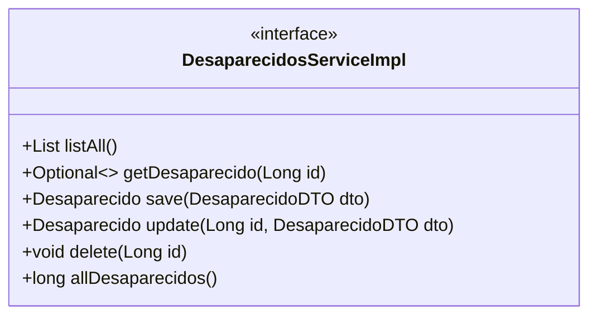
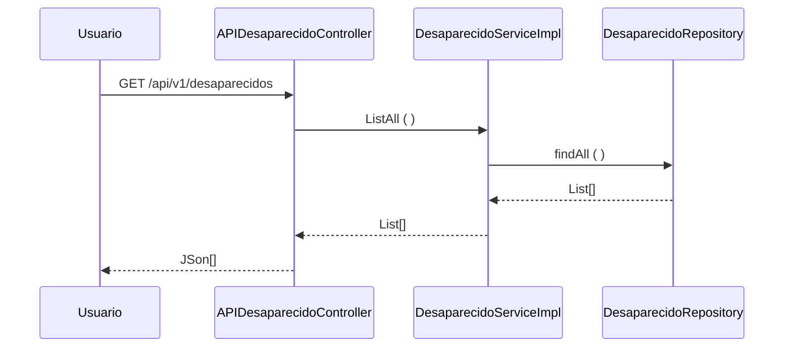

# Api - Radar - Spring Boot (STS)
### Fatec ZL - Centro Paula Souza
##### Disciplina - Programação Web III
Grupo 7
- [Ernesto Amorim](https://github.com/Erne1984)
- [Leornado Leal de Albuquerque](https://github.com/Leohgb)
- [Pablo Angel Choque Flores](https://github.com/PACFWL)
- [Silas Leite](https://github.com/LeiteSS)
##### Processo de Desenvolvimento de Software - PDS
> O Projeto Interdisciplinar segue uma abordagem interativa incremental adaptada do Scrum. Cada interação tem uma definição de pronto estabelecida com objetivo de controlar a qualidade.
##### Estudo de Caso – Sistema Integrado de Gestão
> O sistema RADAR proverá a divulgação de pessoas desaparecidas e cadastrar voluntários.
Esses voluntários irão receber mensagens a respeito de desaparecimentos próximos da região
de onde ele mora e na página onde será divulgado os desaparecidos haverá além dos detalhes
sobre a criança, adolescente ou adulto desaparecido; quem o voluntario deve contatar para
reportar novas informações.
Será integrado back-end ao sistema junto com um banco de dados com as informações
necessárias para entrar nas conformidades do projeto
##### Product Backlog
| ID | Módulo | Sprint | Nome | Como um (a) | Eu quero ser capaz de | Para que eu | Prioridade | Status |
|----------|----------|----------|----------|----------|----------|----------|----------|----------|
| 1  | Desaparecido   | 5   | Inserir Desaparecido   | Funcionário   | Registrar um desaparecido (refere-se ao conjunto dados relacionados à este) no sistema (neste caso uma aplicação web)   | Possa ter registros de desaparecidos   | Alta   | Concluído   |
| 2  | Desaparecido   | Item 12  | Item 13  | Item 14  | Item 15  | Item 16  | Item 17  | Item 18  |
| 3  | Desaparecido   | Item 21  | Item 22  | Item 23  | Item 24  | Item 25  | Item 26  | Item 27  |
| 4  | Desaparecido   | ...      | ...      | ...      | ...      | ...      | ...      | ...      |
| 5  | Desaparecido   |  |  |  |  |  |  |  |
| 5  | Desaparecido   |  |  |  |  |  |  |  |
| 5  | Desaparecido   |  |  |  |  |  |  |  |
| 5  | Desaparecido   |  |  |  |  |  |  |  |
| 5  | Desaparecido   |  |  |  |  |  |  |  |
| 5  | Desaparecido   |  |  |  |  |  |  |  |
| 5  | Desaparecido   |  |  |  |  |  |  |  |
| 5  | Desaparecido   |  |  |  |  |  |  |  |
| 5  | Desaparecido   |  |  |  |  |  |  |  |
| 5  | Desaparecido   |  |  |  |  |  |  |  |
| 5  | Desaparecido   |  |  |  |  |  |  |  |
| 5  | Desaparecido   |  |  |  |  |  |  |  |
| 5  | Desaparecido   |  |  |  |  |  |  |  |
| 5  | Desaparecido   |  |  |  |  |  |  |  |
| 5  | Desaparecido   |  |  |  |  |  |  |  |
| 5  | Desaparecido   |  |  |  |  |  |  |  |
| 5  | Desaparecido   |  |  |  |  |  |  |  |
| 5  | Desaparecido   |  |  |  |  |  |  |  |
| 5  | Desaparecido   |  |  |  |  |  |  |  |
| 5  | Desaparecido   |  |  |  |  |  |  |  |
| 5  | Desaparecido   |  |  |  |  |  |  |  |
| 5  | Desaparecido   |  |  |  |  |  |  |  |
| 5  | Desaparecido   |  |  |  |  |  |  |  |
| 5  | Desaparecido   |  |  |  |  |  |  |  |
| 5  | Desaparecido   |  |  |  |  |  |  |  |
| 5  | Desaparecido   |  |  |  |  |  |  |  |
| 5  | Desaparecido   |  |  |  |  |  |  |  |
| 5  | Desaparecido   |  |  |  |  |  |  |  |
| 5  | Desaparecido   |  |  |  |  |  |  |  |
| 5  | Desaparecido   |  |  |  |  |  |  |  |
| 5  | Desaparecido   |  |  |  |  |  |  |  |
| 5  | Desaparecido   |  |  |  |  |  |  |  |
| 5  | Desaparecido   |  |  |  |  |  |  |  |
| 5  | Desaparecido   |  |  |  |  |  |  |  |
| 5  | Desaparecido   |  |  |  |  |  |  |  |
| 5  | Desaparecido   |  |  |  |  |  |  |  |
| 5  | Desaparecido   |  |  |  |  |  |  |  |
| 5  | Desaparecido   |  |  |  |  |  |  |  |
| 5  | Desaparecido   |  |  |  |  |  |  |  |
| 5  | Desaparecido   |  |  |  |  |  |  |  |
| 5  | Desaparecido   |  |  |  |  |  |  |  |
| 5  | Desaparecido   |  |  |  |  |  |  |  |
| 5  | Desaparecido   |  |  |  |  |  |  |  |
| 5  | Desaparecido   |  |  |  |  |  |  |  |
| 5  | Desaparecido   |  |  |  |  |  |  |  |
| 5  | Desaparecido   |  |  |  |  |  |  |  |
| 5  | Desaparecido   |  |  |  |  |  |  |  |
| 5  | Desaparecido   |  |  |  |  |  |  |  |
| 5  | Desaparecido   |  |  |  |  |  |  |  |
| 5  | Desaparecido   |  |  |  |  |  |  |  |
| 5  | Desaparecido   |  |  |  |  |  |  |  |
| 5  | Desaparecido   |  |  |  |  |  |  |  |
| 5  | Desaparecido   |  |  |  |  |  |  |  |
| 5  | Desaparecido   |  |  |  |  |  |  |  |
##### Análise Estática (Sonarlint)
Durante a análise realizada pelo Sonarlint, foram inicialmente identificados um total de 53 erros. Esses erros foram categorizados em 9 tipos distintos, com 5 deles classificados como avisos e os 4 restantes como problemas graves.
> Constructor has 9 parameters, which is greater than 7 authorized.
> Remove this unused import ------------------------------------------------------------------.
##### Definição de pronto
> O sprint será considerado concluido quando:
> 1) Os casos de teste de aceitação forem executados e obtiverem 100% de satisfatorios. Os casos de teste (CT) são rastreáveis para os requisiitos (REQ). O elo de rastreabilidade
     é estabelecido pelo identificador do caso de teste.
> 2) Depois de executado os casos de teste com 100% de satisfatorios o código deve ser armazenado no github (commit).
> 3) Não tenha qualquer erro no codigo fonte considerado grave, e advertência ou que não tenha uma justificava adequada, após à análise do SonarLint.
##### Casos de teste
| Identificador | Cenário de uso | 
| ------------ | ------------------------------------------------------------------------ | 
| REQ01 | Cadastrar desaparecido |
| REQ01CT01 | Dado (setup) que o desaparecido CPF 111.111.111-11 não está cadastrado; Quando (ação) o usuário solicitar o cadastro do desaparecido; Então (resultado esperado) o sistema envia uma mensagem de desaparecido cadastrado com sucesso | 
| REQ01CT02 | Dado (setup) que o desaparecido CPF 111.111.111-11 está cadastrado; Quando (ação) o usuário solicitar o cadastro do desaparecido; Então (resultado esperado) o sistema envia uma mensagem de desaparecido já cadastrado | 
| REQ01CT03 | Dado (setup) que o desaparecido CPF 111.111.111-11 não está cadastrado; Quando (ação) o  usuário solicitar o cadastro do desaparecido sem informações do endereço; Então (resultado esperado) o sistema envia uma mensagem de dados inválidos |
| REQ02 | Cadastrar funcionario |
| REQ02CT01 | Dado (setup) que o funcionario CPF 111.111.111-11 não está cadastrado; Quando (ação) o   usuário solicitar o cadastro do funcionario; Então (resultado esperado) o sistema envia uma mensagem de funcionario cadastrado com sucesso |
| REQ02CT02 | Dado (setup) que o funcionario CPF 111.111.111-11 está cadastrado; Quando (ação) o  usuário solicitar o cadastro do funcionario; Então (resultado esperado) o sistema envia uma mensagem de funcionario já cadastrado |
| REQ02CT03 | Dado (setup) que o funcionario CPF 111.111.111-11 não está cadastrado; Quando (ação) o usuário solicitar o cadastro do funcionario sem informações do endereço; Então (resultado esperado) o sistema envia uma mensagem de dados inválidos |
| REQ03 | Cadastrar Voluntario |
| REQ03CT01 | Dado (setup) que o voluntario CPF 111.111.111-11 não está cadastrado; Quando (ação)  o usuário solicitar o cadastro do voluntario; Então (resultado esperado) o sistema envia uma mensagem de voluntario cadastrado com sucesso |
| REQ03CT02 | Dado (setup) que o o voluntario CPF 111.111.111-11 está cadastrado; Quando (ação) o  usuário solicitar o cadastro do voluntario; Então (resultado esperado) o sistema envia uma mensagem de voluntario já cadastrado |
| REQ03CT03 | Dado (setup) que o voluntario CPF 111.111.111-11 não está cadastrado; Quando (ação) o  usuário solicitar o cadastro do voluntario sem informações do endereço; Então (resultado esperado) o sistema envia uma mensagem de dados inválidos |

>
O modelo de dominio foi definido considerando as seguintes classes:

>A entidade Desaparecido foi identificada como um serviço (ERL, 2007 - serviço do tipo entidade) o contrado das operações de sistema (LARMAN, 2006, pag.140) foram definidas no diagrama abaixo.

>O diagrama de sequência descreve como os varios componentes arquiteturais colaboram para manipular uma operação de sistema (exemplo para operação consultaTodos())

>Referencias
- [1] KRUCHTEN, Philippe. Reference: Title: Architectural blueprints—the “4+ 1” view model of software architecture. IEEE software, v. 12, n. 6, 1995.
- [2] RICHARDSON, Chris. Microservices patterns: with examples in Java. Simon and Schuster, 2018.
- [3] ERL, Thomas. SOA principles of service design (the Prentice Hall service-oriented computing series from Thomas Erl). Prentice Hall PTR, 2007.
- [4] LARMAN, Craig. Utilizando UML e padrões. 2aed., Porto Alegre: Bookman Editora, 2006 (pag. 147).
